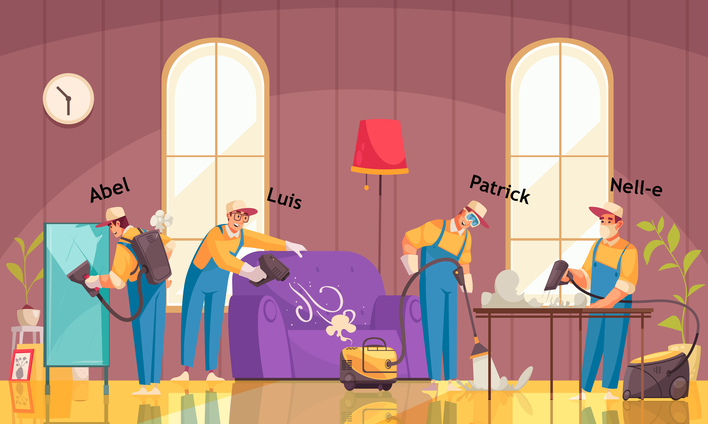

# hausKeepr
[](https://www.gnu.org/licenses/gpl-3.0)

## Mission

Our mission is to provide economic empowerment in this changing world. TheKeeprs created an application that helps the working class find more opportunities for earning money and at the same time, valuable time for themselves and their families and friends. 

### Objectives 

- Create an interface to connect modern-day busy professionals to the best housekeepers near them to obtain house work services at the click of a button. 

- Create a community of individuals such as cleaners, gardeners, window cleaners, and other skilled housekeepers.

- Make use of technology in a way that is helpful for individuals with economic needs and develop trust among communities. 

# Description

HausKeepr is a gig-economy app designed to connect housekeepers to client or working professionals, allowing for an easy and convenient way of getting assistance on house work. 

1. [MVP Link & Screenshots](#mvp)
2. [The User Story ](#story)
3. [User Acceptance Criteria ](#uac)
4. [Database Models ](#mod)
5. [Associations ](#ass)
6. [Special Instructions ](#how)
7. [The Keeprs Team](#team)

<a name="mvp"></a>
## MVP Link & Screenshots

See hausKeepr in action here: https://hauskeepr-mvp.herokuapp.com/

### Homepage
First-time users will land on this page. If users click on *Book and Appointment* they will be redirected to login. If they are already logged in, then the dashboard screen will be displayed.


### Logging in
In order to login, users must enter their username and password on this screen.


### Signing up
If users are not registered, they will have to sign up first via this page.


### Searching for a hauskeepr
On the dashboard page, users can search for a hauskeepr. We are using a single-box search, or Google-style searching. This feature searches on any field on the hauskeepr record, so users don't have to worry about finding the specific field on which they want to search.


### Booking a hauskeepr
Once a client finds the hauskeepr they want to hire, they can click on *Book now* to submit an appointment request. This feature sends an e-mail to the hauskeepr, so that they can reply back to the client. 


<a name="story"></a>
## User Story

AS A busy professional​
I WANT to find skilled housekeepers​
SO THAT I can get things done while having life balance​

<a name="uac"></a>
## Acceptance Criteria

GIVEN a housekeeper finding app

WHEN I login
THEN a home page for me to book and appointment is displayed

WHEN I click on book appointment
THEN a dashboard with search functionality is displayed

WHEN I search for a housekeeper
THEN a list of results is displayed

WHEN I click on book now
THEN a form to book an appointment is displayed

WHEN I submit an appointment form
THEN an email is generated to the housekeeper

WHEN I logout
THEN the homepage is rendered again

WHEN I click on signup
THEN a signup form is displayed

WHEN I submit the signup form
THEN my user is created and I'm redirected to Login

<a name="mod"></a>
## Database Models
The following models were created to store the app information:

- `Client`

| Column | Data Type | PK | NN | Notes |
|--------|-----------|----|----|---------------|
| id     | INTEGER   | Y  | Y  | Auto increment|
| username | STRING  |    | Y  | |
| password | STRING   |    | Y  | LEN(8,32) ENCRYPTED|
| email | STRING |    | Y  | |
| first_name | STRING |    | Y  | |
| last_name | STRING |    | Y  | |
| date_of_birth | DATE |    | Y  | |
| address_line_1 | STRING |    | Y  | |
| address_line_2 | STRING |    | Y  | |
| city | STRING |    | Y  | |
| zip_code | STRING |    | Y  | |
| state | STRING |    | Y  | |
| created_at | DATETIME | | Y  | |
| updated_at | DATETIME | | Y  | |

- `Hauskeepr`

| Column | Data Type | PK | NN | Notes |
|--------|-----------|----|----|---------------|
| id     | INTEGER   | Y  | Y  | Auto increment|
| username | STRING  |    | Y  | |
| password | STRING   |    | Y  | LEN(8,32) ENCRYPTED|
| email | STRING |    | Y  | |
| first_name | STRING |    | Y  | |
| last_name | STRING |    | Y  | |
| date_of_birth | DATE |    | Y  | |
| address_line_1 | STRING |    | Y  | |
| address_line_2 | STRING |    | Y  | |
| city | STRING |    | Y  | |
| zip_code | STRING |    | Y  | |
| state | STRING |    | Y  | |
| profession_id | INTEGER |    | Y  | FK Profession |
| hourly_rate | DECIMAL(0,2) |    | Y  | |
| created_at | DATETIME | | Y  | |
| updated_at | DATETIME | | Y  | |

- `Appointment`

| Column | Data Type | PK | NN | Notes |
|--------|-----------|----|----|---------------|
| id     | INTEGER   | Y  | Y  | Auto increment|
| datetime | DATE  |    | Y  | |
| client_id | INTEGER   |    | Y  | FK Client|
| hauskeepr_id | INTEGER |    | Y  | FK Hauskeepr|
| notes | STRING |    | Y  | |
| status | STRING |    | Y  | |
| hours | INTEGER |    | Y  | |
| total_cost | DECIMAL(0,2) |    | Y  | |
| created_at | DATETIME | | Y  | |
| updated_at | DATETIME | | Y  | |

- `Appointment`

| Column | Data Type | PK | NN | Notes |
|--------|-----------|----|----|---------------|
| id     | INTEGER   | Y  | Y  | Auto increment|
| datetime | DATE  |    | Y  | |
| client_id | INTEGER   |    | Y  | FK Client|
| hauskeepr_id | INTEGER |    | Y  | FK Hauskeepr|
| notes | STRING |    | Y  | |
| status | STRING |    | Y  | |
| hours | INTEGER |    | Y  | |
| total_cost | DECIMAL(0,2) |    | Y  | |
| created_at | DATETIME | | Y  | |
| updated_at | DATETIME | | Y  | |

- `Profession`

| Column | Data Type | PK | NN | Notes |
|--------|-----------|----|----|---------------|
| id     | INTEGER   | Y  | Y  | Auto increment|
| profession_name | STRING  |    | Y  | |
| created_at | DATETIME | | Y  | |
| updated_at | DATETIME | | Y  | |

- `Review`

| Column | Data Type | PK | NN | Notes |
|--------|-----------|----|----|---------------|
| id     | INTEGER   | Y  | Y  | Auto increment|
| client_id | INTEGER  |    | Y  | FK Client|
| hauskeepr_id | INTEGER | | Y  | FK Hauskeepr|
| stars | INTEGER | | Y  | min: 0, max: 5 |

PK : Primary Key
NN : Not Nullable
FK : Foreign Key

<a name="ass"></a>
## Associations

A client can create many reviews, and each review belongs to one client.
```javascript
Client.hasMany(Review, {
    foreignKey: 'client_id'
});

Review.belongsTo(Client, {
    foreignKey: 'client_id'
});
```
A review belongs to one hauskeepr, and a hauskeepr can have many reviews.
```javascript
Review.belongsTo(Hauskeepr, {
    foreignKey: 'hauskeepr_id'
});

Hauskeepr.hasMany(Review, {
    foreignKey: 'hauskeepr_id'
});
```

Clients can create many appointments, and hauskeeprs will have many appointments assigned to them. 
```javascript
Client.hasMany(Appointment, {
    foreignKey: 'client_id'
});

Hauskeepr.hasMany(Appointment, {
    foreignKey: 'hauskeepr_id'
});
```

An appointment belongs to one client and to one hauskeepr at any given time.
```javascript
Appointment.belongsTo(Client, {
    foreignKey: 'client_id'
});

Appointment.belongsTo(Hauskeepr, {
    foreignKey: 'hauskeepr_id'
});
```

Each hauskeepr has a profession.
```javascript
Hauskeepr.belongsTo(Profession, {
    foreignKey: 'profession_id'
});
```

<a name="how"></a>
## Special Instructions

- In order to run the app locally, add a .env file to the root of the app with the following details

```text
DB_NAME='****_db'
DB_USER='xxx'
DB_PW='xxx'
```

<a name="team"></a>
# The Keeprs

